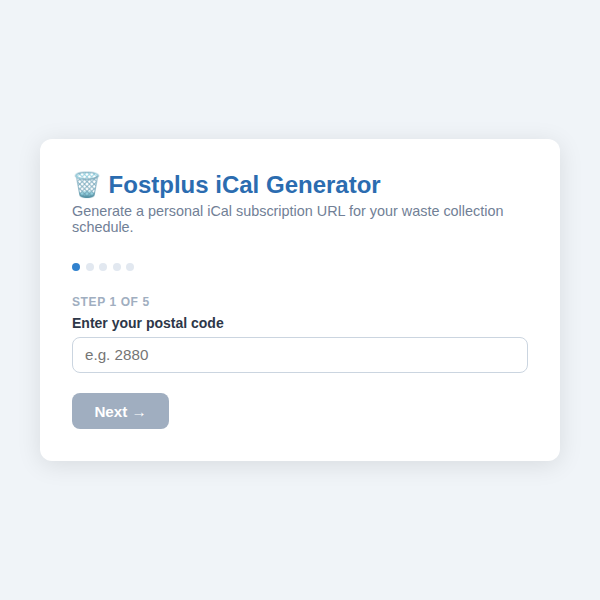
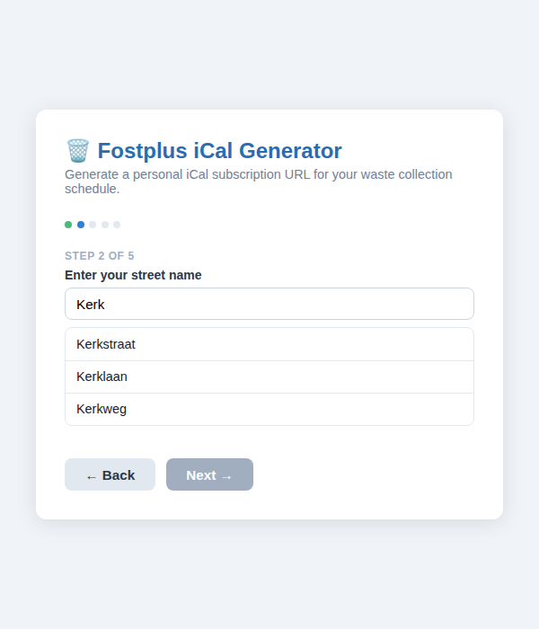
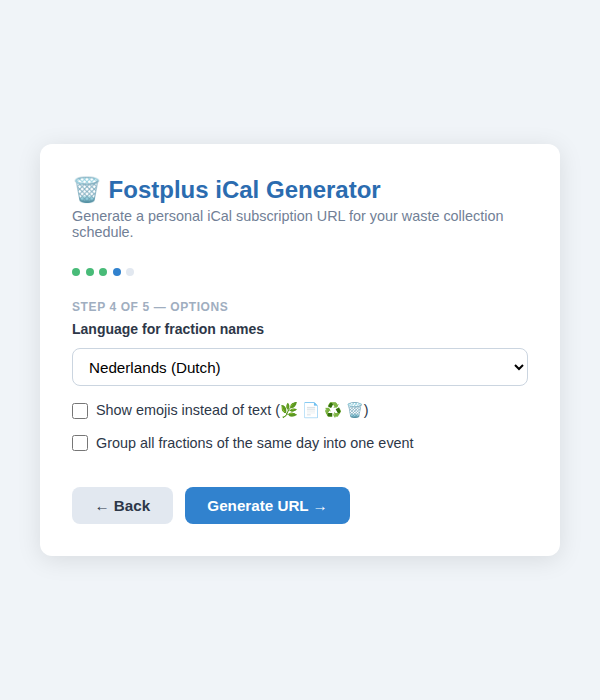
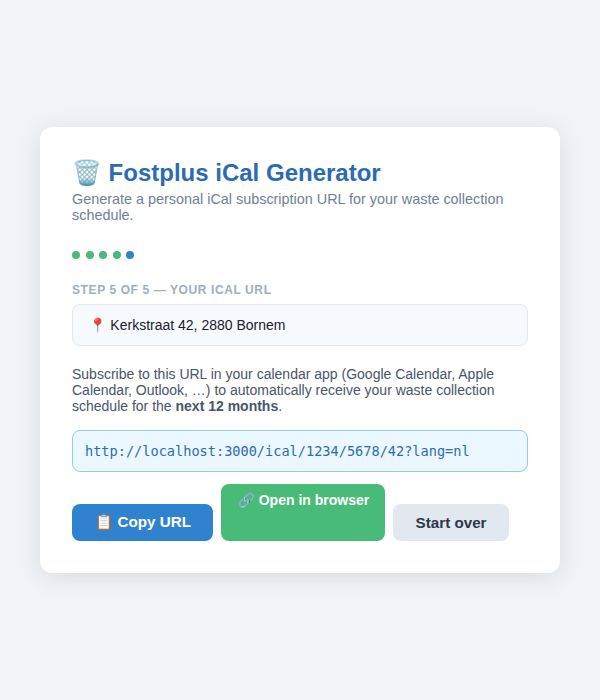

# 🗑️ fostplus-ical-webserver

[](https://nodejs.org/)
[](https://www.typescriptlang.org/)
[](https://expressjs.com/)
[](https://opensource.org/licenses/ISC)

A self-hostable Node.js web application that lets Belgian residents look up their home address and generate a **personalised iCal subscription URL** for their [Fostplus](https://www.fostplus.be/) waste-collection schedule.

Subscribe once in Google Calendar, Apple Calendar or Outlook — your collection dates update automatically for the next 12 months. 📅

---

## Screenshots

<table>
  <tr>
    <td align="center"><strong>Step 1 — Postal code</strong><br/></td>
    <td align="center"><strong>Step 2 — Street search</strong><br/></td>
  </tr>
  <tr>
    <td align="center"><strong>Step 4 — Options</strong><br/></td>
    <td align="center"><strong>Step 5 — Your iCal URL</strong><br/></td>
  </tr>
</table>

---

## Features

- 🏠 **5-step address wizard** — postal code → street → house number → options → URL
- 🌍 **Multilingual** — fraction names in Dutch (default), English or French
- 😀 **Emoji mode** — swap text labels for emojis (🌿 📄 ♻️ 🗑️ …)
- 📆 **Day grouping** — combine all fractions of the same day into one calendar event
- 🔗 **Stable, shareable URL** — bookmark or share your personal iCal feed
- 📅 **12 months of events** — always up to date when your calendar app refreshes
- 📋 **One-click copy** and direct browser link for easy setup
- Works with **Google Calendar, Apple Calendar, Outlook** and any iCal-compatible app

---

## Prerequisites

- **Node.js 18+**
- A **Fostplus API consumer key** (`x-consumer` header value).  
  This value is publicly used by the Fostplus recycling website. You can find it by inspecting the network requests on [fostplus.be](https://www.fostplus.be/) or from the [`fostplus-api-wrapper`](https://github.com/LeventHAN/fostplus-api-wrapper) project tests.

---

## Quick start

```bash
# 1. Clone the repository
git clone https://github.com/CatLabInteractive/fostplus-ical-webserver.git
cd fostplus-ical-webserver

# 2. Install dependencies
npm install

# 3. Create your .env file
cp .env.example .env
# Edit .env and set FOSTPLUS_CONSUMER_KEY=<your key>

# 4. Build and start (production)
npm run build
npm start

# – or run in development mode (auto-reload)
npm run dev
```

Open <http://localhost:3000> in your browser to use the address wizard.

---

## Environment variables

| Variable                | Required | Default | Description                              |
|-------------------------|----------|---------|------------------------------------------|
| `FOSTPLUS_CONSUMER_KEY` | ✅ yes   | —       | The `x-consumer` key for the Fostplus API |
| `PORT`                  | no       | `3000`  | TCP port the server listens on            |

---

## API endpoints

| Method | Path                                      | Description                                         |
|--------|-------------------------------------------|-----------------------------------------------------|
| `GET`  | `/`                                       | Address wizard UI                                   |
| `GET`  | `/api/zipcodes?q=<term>`                  | Search for postal codes matching `term`             |
| `GET`  | `/api/streets?q=<term>&zipcodeId=<id>`    | Search for streets matching `term` in the given zip |
| `GET`  | `/ical/:zipcodeId/:streetId/:houseNumber` | Download / subscribe to the iCal feed               |

### iCal query parameters

| Parameter | Values           | Default | Description                                           |
|-----------|------------------|---------|-------------------------------------------------------|
| `lang`    | `nl`, `en`, `fr` | `nl`    | Language for fraction names (Dutch, English, French)  |
| `emoji`   | `true`, `false`  | `false` | Replace text labels with emojis (🌿 📄 ♻️ 🗑️ …)     |
| `group`   | `true`, `false`  | `false` | Group all fractions of the same day into a single event |

### iCal URL examples

```
# Dutch (default), individual events
http://localhost:3000/ical/zipcode-id-here/street-id-here/42

# English, emoji labels, grouped by day
http://localhost:3000/ical/zipcode-id-here/street-id-here/42?lang=en&emoji=true&group=true

# French, text labels
http://localhost:3000/ical/zipcode-id-here/street-id-here/42?lang=fr
```

---

## Project structure

```
.
├── public/
│   ├── index.html       # Single-page address wizard
│   └── robots.txt       # Disallow all search engine indexing
├── screenshots/         # README screenshots
├── src/
│   ├── app.ts           # Express app entry point
│   └── routes/
│       ├── api.ts       # /api/zipcodes and /api/streets
│       └── ical.ts      # /ical/:zipcodeId/:streetId/:houseNumber
├── .env.example
├── package.json
└── tsconfig.json
```

---

## Contributing

Pull requests and issues are welcome! Please open an issue first for significant changes.

---

## License

[ISC](https://opensource.org/licenses/ISC)
